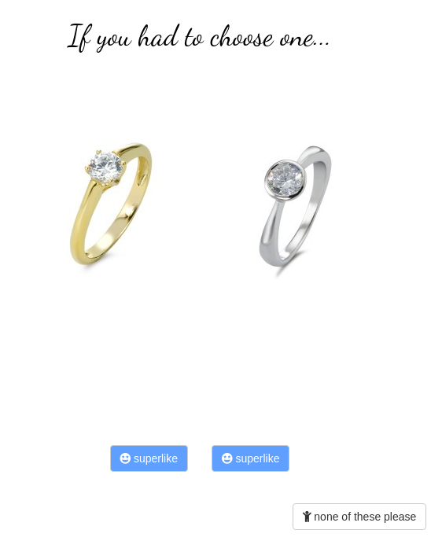

# Engagement ring

R Shiny application for finding out about your girlfriend's engagement ring preferences.



## How it works

At each round two random images are shown. The user can click on one according to his preference. With the *superlike* button, one can express special liking. If out of the two images both are not liked, one can select *none of those*.

Initially, a data frame with the image paths is created and saved in [feather format](https://blog.rstudio.com/2016/03/29/feather/). It is alimented by the contents in the *rings* folder. If it already exists, then it is simply loaded. **Feather** is a fast storage format for R (and support in Python). It is particularely useful in web applications.

There is the option to build in *easter egg* images in a *specials* folder. The probability of showing a special image set is defined as *easteregg_prob* in `randomid()`.

The user inputs are written to a timestamped csv, see *sessionfile*.

Shiny allows to create a *clickable* plot or image with `renderImage()` and `imageOutput()`. User clicking on an image or plot can be used as an input. For example:

```
# ui
imageOutput("image1", click = "first")

# server
observeEvent(input$first, { ... })
```

To **append to csv** we use `write.table()`.

```
write.table(tblheader, file = sessionfile, sep = ",", col.names = F)
```

with tblheader being a one-row matrix to append, and sessionfile being the timestamped csv.

The csv file can later be used for analysis of the preference.

Notes:

* The images were downloaded from a jewelry seller's website using [Simple mass downloader](https://chrome.google.com/webstore/detail/simple-mass-downloader/abdkkegmcbiomijcbdaodaflgehfffed) Chrome extension.
* It supports several 100s of images.
* Why would one use R Shiny for this? Yes, there are a lot of frameworks that would do the job, but why not Shiny? As I would also do the user's data analysis in R later, it's a tool that is easily available and fast for an app one needs nothing but a one-use prototype.


